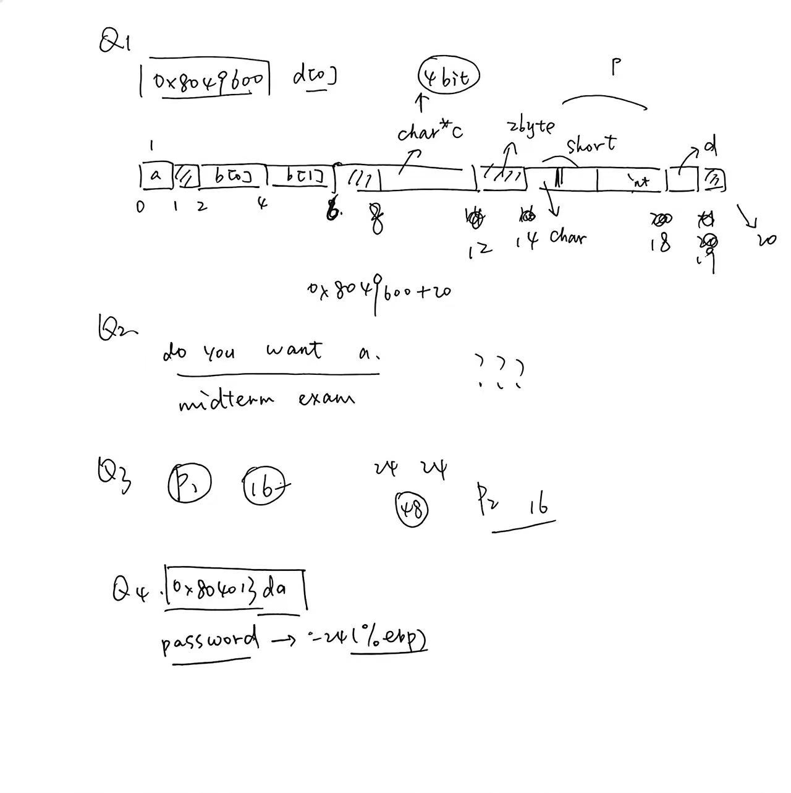

## Homework7

姓名 邢添珵
学号 2024202862

------------------------------
### Q1
##### Suppose the address of global variable is 0x8049600
``` c
struct data {
  char a;
  short b[2];
  char *c;

  union {
    char x;
    short y;
    int z;
  } p;

  char d;
};

struct data d[2];
```
##### Fill in the form (on a 32-bit machine)
| Variable  | Start Address |
|:---------:|:-------------:|
| d[0]      | 0x8049600     |
| d[1]      |           |
| d[0].a    |               |
| d[0].b[1] |               |
| d[0].c    |               |
| d[0].p.y  |               |
| d[0].p.z  |               |
| d[0].d    |               |

##### Answer1
| Variable  | Start Address |
|:---------:|:-------------:|
| d[0]      | 0x8049600     |
| d[1]      |   0x8049614        |
| d[0].a    |       0x8049600        |
| d[0].b[1] |     0x8049604          |
| d[0].c    |      0x8049608         |
| d[0].p.y  |      0x804960C         |
| d[0].p.z  |         0x804960C      |
| d[0].d    |       0x8049610        |

### Q2
##### What’s the output of the following C program? (on a 32-bit machine)
```c
int main()
{
  static char char_table[3][13] = 
  {{'d', 'o', 32, 'y', 'o', 'u', 32, 'w', 'a', 'n', 't', 32, 'a'},
   {32, 109, 105, 100, 116, 101, 114, 109, 32, 101, 120, 97, 109}, 
   {0}};

  static char ans[] = "abcdefghijklmnopqrstuvwxyyz";

  printf("%s?\n", char_table);

  printf("%c%c%c!\n",
         (char)(((char **)ans)[6]),
         (char)(((char *)ans)[4]),
         (char)(ans[18]));

  return 0;
}
```
#### Answer2

```bash
do you want a midterm exam?
yes!
```


### Q3
##### For each of the following structure declarations, determine the offset of each field, the total size of the structure, and its alignment requirement under x86-64.
- A. struct P1 { int I; char c; long j; char d;};
- B. struct P2 { long I; char c; char d; int j;}; 
- C. struct P3 { short w[3]; char c*[3]};
- D. struct P4 { struct P1 a[2]; struct P2 *p}; 
- E. struct P5 { short w[3]; char c[3]}. 

#### Answer3


| | Offset 1 | Offset 2 | Offset 3 | Offset 4 | Total size | Alignment |
|:---:|:---:|:---:|:---:|:---:|:---:|:---:|
| A | i:0 | c:4 | j:8 | d:16 | 24 | 8 |
| B | i:0 | c:8 | d:9 | j:12 | 16 | 8 |
| C | w:0 | c:8 | | | 32 | 8 |
| D | a:0 | p:48 | | | 56 | 8 |
| E | w:0 | c:6 | | | 10 | 2 |


### Q4
##### Suppose we have the following function ‘login’ to perform login process.
```c
int login()
{
  char username[8];
  char password[8];
  gets(username);
  gets(password);
  return check_match_in_database(username, password);
}
```

##### Here is a part of the function’s assembly. 
```nasm
Pushl %ebp 
movl  %esp, %ebp 
subl  $40, %esp 
leal  -16(%ebp), %eax 
movl  %eax, (%esp)
call  _gets
leal  -24(%ebp), %eax 
movl  %eax, (%esp) 
call  _gets
......
```

In the normal process, if the username and the password are both ok, the function ‘login_ok’ will be called to indicate login success. We’ve already known that the address of ‘login_ok’ is 0x804013da. Can you construct an input to make the function ‘login_ok’ be called after ‘login’ returns? You need to specify the key bytes and their positions rather than the complete input. And give one brief explanation about your input. 

#### Answer4

在`username`输入阶段输入`28`字节的`padding`后输入`0xda 0x13 0x40 0x80`

分析：

栈帧示意图：

```nasm
   高地址 
      ^
      |
+----------------------+ 
|                      | <--- 返回地址，EBP + 4
|    返回地址           |     
+----------------------+ 
|       %ebp           | <--- EBP 
|                      |      
+----------------------+ 
|                      | 
|                      | 
|                      |
|      Padding         | <--- EBP - 8
|                      |      
+----------------------+ 
|                      | 
|      username        | 
|                      | <--- EBP - 16 
+----------------------+ 
|                      | 
|      password        | 
|                      | <--- EBP - 24 
+----------------------+ 
      |
      v
   低地址 
```

因此只需要输入`28`字节`padding`就可以到达栈帧中存放返回地址的位置，然后按小端序写入地址`0x804013da`即可。

附：


