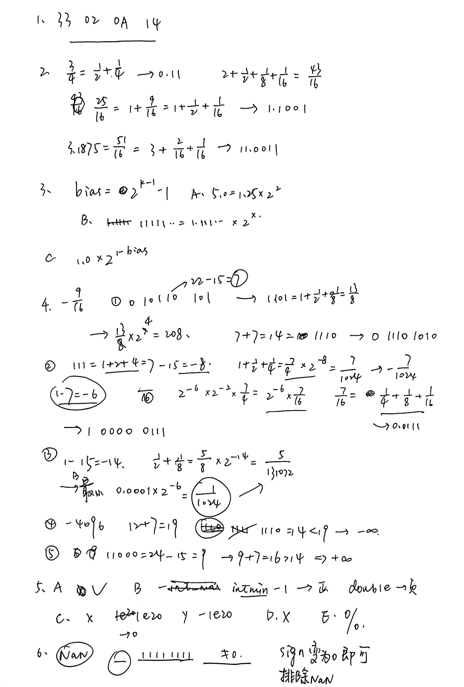

# ICS作业3答案

邢添珵　2024202862

---

## 1

|       | little-endian | big-endian |
|---------------|------|-------|
| show_bytes(valp, 1)  | 33  | 14 |
| show_bytes(valp, 2) |  33 02 |  14 0A  |
| show_bytes(valp, 4) | 33 02 0A 14 | 14 0A 02 33  |

---

## 2

|   Fraction value     | Binary representation | Decimal representation |
|---------------|------|  -------|
| 1/8  | 0.001  | 0.125 |
| 3/4 | 0.11  |  0.75  |
| 43/16 | 10.1011 |  2.6875 |
| 25/16  | 1.1001  | 1.5625 |
| 51/16 |  11.0011 |  3.1875  |

---

## 3

- **指数 E (exp是存储的指数值)：**
  $$
  E = exp - 2^{k-1} + 1
  $$

- **尾数 M：**
  $$
  M = 1 + f
  $$

- **小数部分 f：**
  $$
  f = \sum_{i=1}^{n}
  f_i是二进制位
  $$

- **数值 V：**
  $$
  V = (-1)^s \times M \times 2^E
  $$

#### A. 数字 5.0
- **对于 5.0：**
  $$
  5.0 = 1.25 \times 2^2
  $$
  因此  
  $s = 0,\quad E = 2,\quad M = 1.25,\quad f = 0.25$

  位级表示为 0 100...0001 01000..0
---

#### B. 可精确表示的最大奇整数

- 最大奇整数应为 11111...11，可以表示为 $ 1.11...1 \times 2^{x} $
故
$ s = 0 , \quad E = x , \quad M = 1.1111... , \quad f = 0.111...$
---

#### C. 最小正规格化数的倒数

- 最小正规格化数：
  $$
  V = 1.0 \times 2^{1 - bias}
  $$
- 其倒数：
  $$
  \frac{1}{V} = 2^{bias - 1}
  $$

  故 $ s = 0, \quad E = bias - 1 = 2 ^{k-1}-2, \quad M = 1, \quad f = 0 $

  
---

## 4

| Format A |   | Format B|    |
|-------------|---|----|-----|
| Bits        | Value       | Bits        | Value       |
| 1 01110 001 |   $-\frac{9}{16}$  | 1 0110 0010 | $-\frac{9}{16}$ |
| 0 10110 101 |     208        |     0 1110 0101   |    208   |
| 1 00111 110 |  $-\frac{7}{1024}$ | 1 0000 0111 |$-\frac{7}{1024}$ |
| 0 00000 101 | $\frac{5}{131072}$| 0 0000 0001| $\frac{1}{1024}$|
| 1 11011 000 | -4096| 1 1111 0000  | -Inf| 
| 0 11000 100 |  768|0 1111 0000 |  Inf|

## 5
- A
  恒为 1 。都基于相同的整数做是融入。
- B
  不恒为 1 。比如取 $ x = -2147483648 (int 下界), \quad y = 1 $
- C
  不恒为 1 . 比如取 $ x = 1e20, \quad y = -1e20 , \quad z = 1$
  此时 $ (dx + dy) + dz = 1.0 ,\quad  dx + (dy + dz) = 0.0 $
- D 
  不恒为 1. 浮点乘法有舍入误差 因此不满足结合律
- E
  不恒为 1。 取 $ x = 0 或 z = 0 $ 即可，此时 0.0 / 0.0 为 NaN


## 6
```c
typedef unsigned float_bits;
/* Compute |f|. If f is NaN, then return f. */
float_bits float_absval (float_bits f) {
  unsigned exp = (f >> 23) & 0xff, frac = f & 0x7fffff;
  if (exp == 0xff && frac != 0) return f;

  return f & 0x7fffffff;
}
```

## 7

```c
/* Compute 2*f. If f is NaN, return f. */
float_bits float_twice(float_bits f) {
  unsigned sign = f & (1 << 31), exp = (f >> 23) & 0xff, frac = f & 0x7fffff;
    
  if (exp == 0xff)
      return f;

  if (exp == 0) {
      frac <<= 1; 
      if (frac & (1 << 31)) {
          exp = 1;
          frac &= 0x7fffff;
      }
  } 
  else {
      exp += 1;
      if (exp == 0xff)
          frac = 0;
  }

  return sign | (exp << 23) | frac;
}

```

附：
