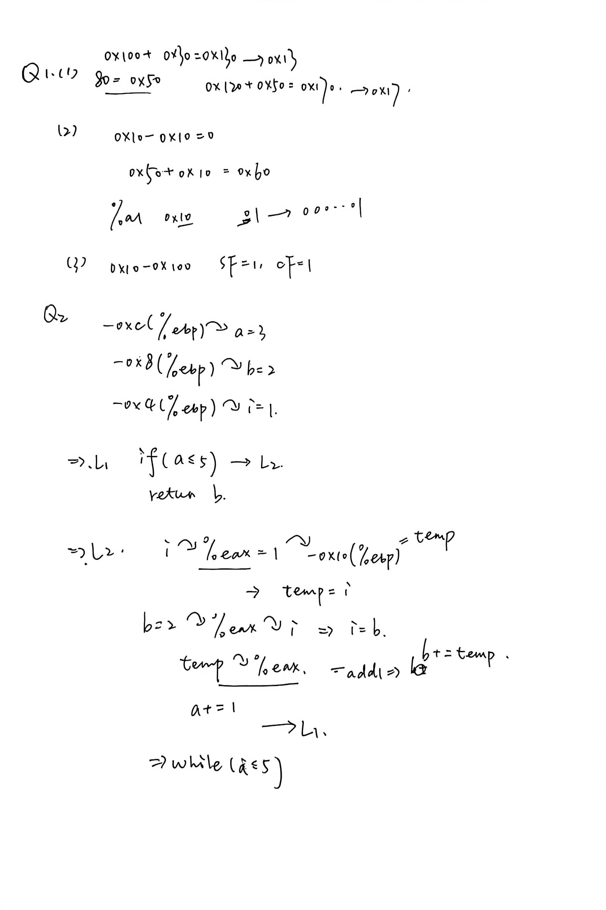

## Homework4

邢添珵 2024202862

------------------------------
### Q1(1)
##### Assume we have following address binding table and value of registers : 

| Address | Value | Register | Value| 
|---------|-------|----------|------|
| 0x100   | 0x10  |   %eax   | 0x10 |
| 0x110   | 0x11  |   %ebx   | 0x100|
| 0x120   | 0x12  |          |      |
|    ...  |  ...  |    ...   |  ... |
| 0x190   |  0x19 |          |     |
| 0x200   |  0x20 |          |     |

#### Answer1(1)
##### Please fill in the table below 

|Operand | Value|
|--------|-----|
|%ebx| 0x100 |
|$0x150| 0x150 |
|0x170| 0x17 |
|(%ebx)| 0x10|
|(%ebx,%eax)| 0x11|
|0x30(%ebx)|0x13 |
|80(%ebx,%eax,2)| 0x17 |

### Q1(2)
##### Suppose registers and bound values will be reset as above after each instruction. Please fill in the table below: (Write all if there are more than one destinations and None if there is no destination) 

#### Answer1(2)
| Instruction | Destination | Value |
| ----------- | ----------  | ----  |
addl %eax,%ebx | %ebx | 0x110 |
subl %eax,(%ebx) | 0x100 | 0 |
leal 0x50(%eax), %edx | %edx | 0x60 |
movzbl %al, %ebx | %ebx| 0x00000010|
movsbl %bh, %ecx |%ecx | 0x00000001 |

   

### Q1(3)
##### Assume the initial value of the flags is 0. Fill the table below 
#### Answer1(3)
| Instruction | OF | SF | ZF | CF|
| ----------- | -- | -- | ---|---| 
leal (%eax),%ebx|0 | 0 | 0 | 0|
subl %ebx, %eax| 0 | 1 | 0| 1 |
xorl %eax, %eax| 0 |0  | 1|0 |
test %eax, %ebx| 0 | 0 | 1 | 0| 


### Q2
- Translate the following assembly into C codes.
- You can name local variables represented by -12(%ebp), -8(%ebp)...or a,b,c... freely as you like. 
- The beginning of C codes is given. 

#### Answer2

```c++
int func() {
    int a = 3;
    int b = 2;
    int i = 1;
    int temp;

    while (a <= 5) {
        temp = i;
        i = b;
        b += temp;
        a += 1;
    }

    return b;
}
```

附：
